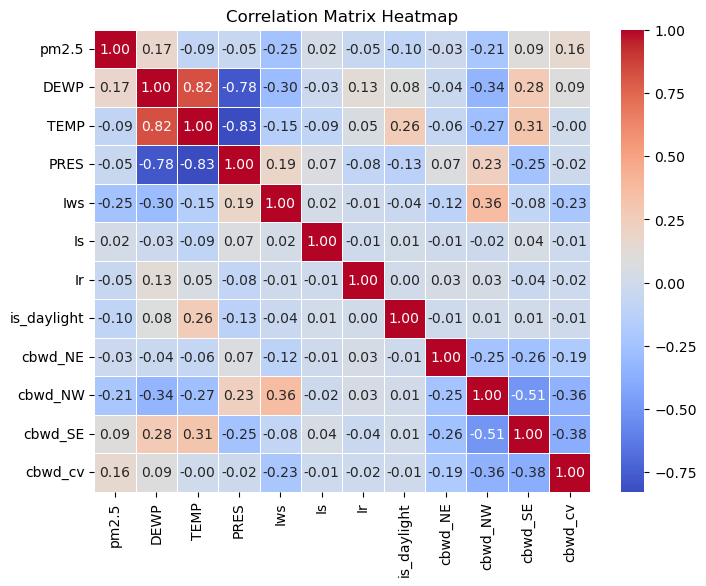

# Beijing Air Quality — TSA Lab 3

This repository contains materials for Lab 3 of a Time Series Analysis (TSA) project focusing on Beijing air quality data. The analysis explores relationships between meteorological variables and air pollution, performs clustering and dimensionality reduction, and builds forecasting models.

Primary files
---------------

- `BEIJING.csv` — the dataset used for analysis (air quality and meteorological measurements for Beijing).
- `TSA3.ipynb` — the Jupyter notebook containing the full analysis: data inspection, preprocessing, EDA, feature engineering, modeling and visualization.
- `images/` — figures produced by the notebook and included here as a visual summary.

What this project demonstrates
------------------------------

- Exploratory Data Analysis (correlation structure, distributions, seasonality)
- Unsupervised learning for structure discovery (k-means clustering, elbow plots)
- Dimensionality reduction and explained variance (PCA or similar)
- Supervised forecasting (tree-based or boosting models) and model interpretation (feature importance)
- Model evaluation (confusion matrices for classification-like tasks or residual diagnostics for regression/forecasting)

Dataset overview (brief)
------------------------

The `BEIJING.csv` file contains time-stamped observations of air quality and weather-related variables. Typical columns include pollutant concentrations and meteorological measures (temperature, wind direction/speed, humidity, etc.). The notebook performs cleaning and aligns timestamps for time series modeling.

Gallery — selected figures
--------------------------

Below are figures that illustrate the key parts of the analysis. Images are stored in the `images/` directory. If a viewer does not render images inline, open the files directly in the `images/` folder.

### Correlation structure

*Correlation heatmap showing the pairwise relationships between measured variables.*

### Explained variance

*Scree / explained-variance plot used to choose the number of principal components or components retained for analysis.*

### Feature importance

*Model-derived ranking of the most important predictors for the forecasting model.*

### Confusion matrix and model diagnostics

*If classification-style evaluation is used, this confusion matrix visualizes true vs predicted categories. For regression/forecasting, analogous diagnostic plots are included in the notebook.*

### Clustering and elbow analysis

*Elbow plot for selecting K in KMeans clustering.*

*Illustrative clustering of observations in a reduced-dimension space.*

### Forecast examples and meteorological visuals

*Example forecast from a boosting model; may show predicted vs actual pollutant levels.*

*An example visualization comparing temperature trends across wind-direction categories.*
